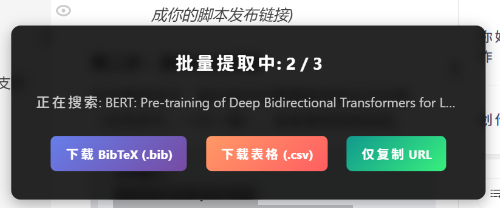
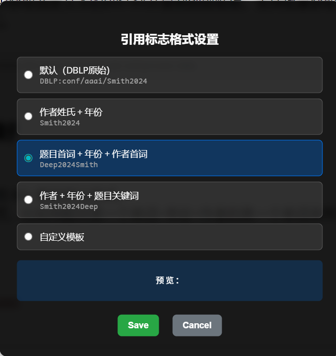

# 标题批量导出DBLP的BibTeX · DBLP-BibTex-dump

在网页左下角生成一个按钮，从dblp中获取选定文本的BibTeX并复制到剪贴板。支持批量获取，支持从剪贴板读取，支持随时下载，支持导出URL和CSV。

## 下载链接

[https://greasyfork.org/zh-CN/scripts/522825-标题批量导出DBLP的BibTeX](https://greasyfork.org/zh-CN/scripts/522825-%E6%A0%87%E9%A2%98%E6%89%B9%E9%87%8F%E5%AF%BC%E5%87%BAdblp%E7%9A%84bibtex)

## 功能特性

### 核心功能
- **一键获取** - 选中论文标题即可自动获取BibTeX引用
  
- **批量处理** - 支持一次选中多个标题，自动批量提取
  
- **智能剪贴板** - 未选中文本时自动读取剪贴板内容
- **随时导出** - 支持导出过程中，随时下载.bib文件、导出CSV表格、复制URL列表

### 高级功能
- **自定义引用格式** - 支持多种引用标志模板（作者+年份、题目关键词等），可自定义占位符
  
- **Google Scholar 集成** - 失败项一键打开 Google Scholar 搜索，支持批量处理
- **智能文本清理** - 自动去除中文字符和标点符号，确保 DBLP 搜索准确
- **白名单模式** - 仅在指定网站显示按钮，避免干扰其他网页
  
- **全局开关** - 支持一键禁用/启用功能
- **实时预览** - 批量处理时显示当前进度和状态

### 引用格式示例
- `默认格式` - 保持DBLP原始格式（如：`DBLP:conf/aaai/Smith2024`）
- `作者+年份` - 简洁格式（如：`Smith2024`）
- `题目首词+年份+作者` - 语义化格式（如：`Deep2024Smith`）
- `自定义模板` - 支持`{firstAuthor}`、`{year}`、`{firstWord}`、`{titleWords:N}`等占位符

## 使用说明

1. 首先，你需要安装油猴插件，如果不知道怎么装请看我的视频：[【浏览器脚本入门】①下载油猴_哔哩哔哩_bilibili](https://www.bilibili.com/video/BV1AN4y1Y7mo)
2. 其次，你可以通过 Greasy Fork 安装我的脚本：[https://greasyfork.org/zh-CN/scripts/522825-标题批量导出DBLP的BibTeX](https://greasyfork.org/zh-CN/scripts/522825-%E6%A0%87%E9%A2%98%E6%89%B9%E9%87%8F%E5%AF%BC%E5%87%BAdblp%E7%9A%84bibtex)
3. 配置引用格式：点击油猴图标 → "设置引用标志格式" → 选择预设或自定义模板
4. 配置白名单（可选）：点击油猴图标 → "设置站点白名单"

## 详细教程

更多使用技巧和功能演示，请查看博客文章：
[【开源工具】DBLP-BibTex-dump｜仅需论文标题一键批量提取 DBLP BibTeX，支持导出 CSV 和 URL！](https://shandianchengzi.blog.csdn.net/article/details/144936343)

## 版本历史

### v3.1 (最新)
- ✨ **新增**：批量结果可视化界面
  - 成功和失败结果分别显示，直观查看提取情况
  - 成功结果显示完整 BibTeX 内容（只读）
  - 失败结果显示原始搜索词（可编辑，方便重试）
- ✨ **新增**：Google Scholar 搜索集成
  - 失败项可直接点击 "Scholar" 按钮，打开 Google Scholar 搜索
  - 支持批量打开多个搜索标签页
  - 智能确认对话框，预览即将打开的 URL
- ✨ **新增**：复制功能增强
  - 成功和失败区域独立复制按钮
  - 图标+文字设计，更加醒目易用
- ✨ **新增**：界面优化
  - 右上角圆形关闭按钮，节省界面空间
  - 中文文本自动清理，去除中文汉字和标点符号，避免干扰 DBLP 搜索
  - 显示处理进度和结果统计（如"批量提取完成（10条）"）

### v3.0
- ✨ **新增**：自定义引用标志格式功能
  - 支持4种预设格式（默认、作者+年份、题目首词+年份+作者、作者+年份+题目关键词）
  - 支持自定义模板，使用占位符自由组合
  - 实时预览引用格式效果
  - 自动解析作者、年份、标题字段并生成新的引用键

### v2.0
- ✨ **新增**：白名单设置功能
  - 仅在指定网站显示按钮
  - 支持添加当前域名到白名单
  - 支持全局禁用/启用开关

### v1.4
- ✨ **新增**：批量获取模式
- ✨ **新增**：CSV导出功能
- ✨ **新增**：URL列表导出功能
- ✨ **新增**：剪贴板智能读取

## 贡献

如果你有任何建议或者想要添加新的功能，欢迎提交 issue 或者 PR。